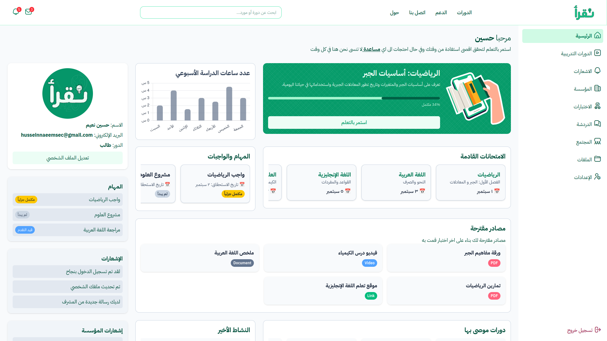
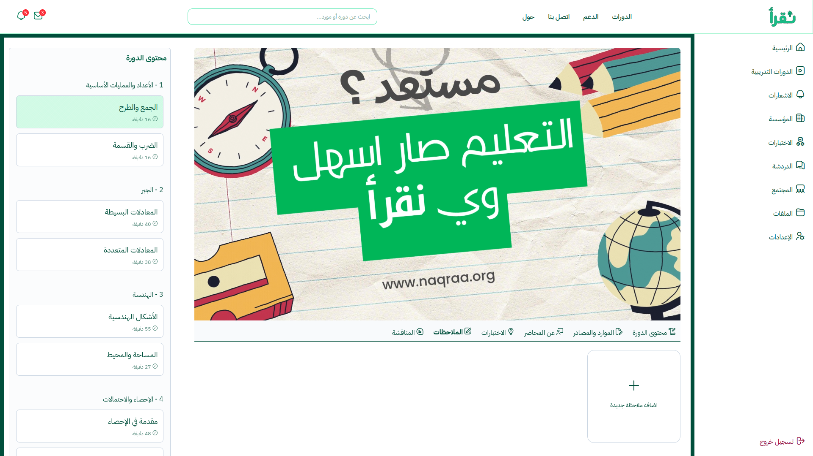
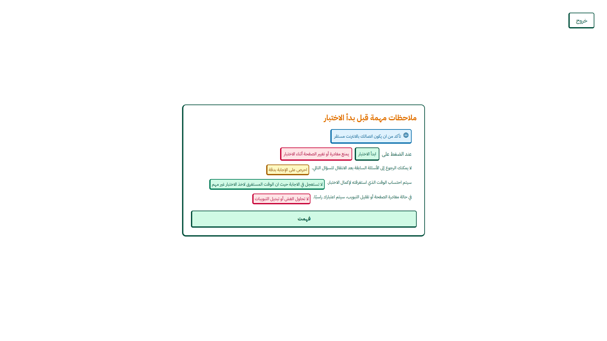
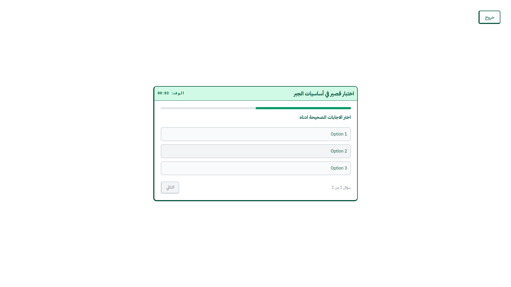
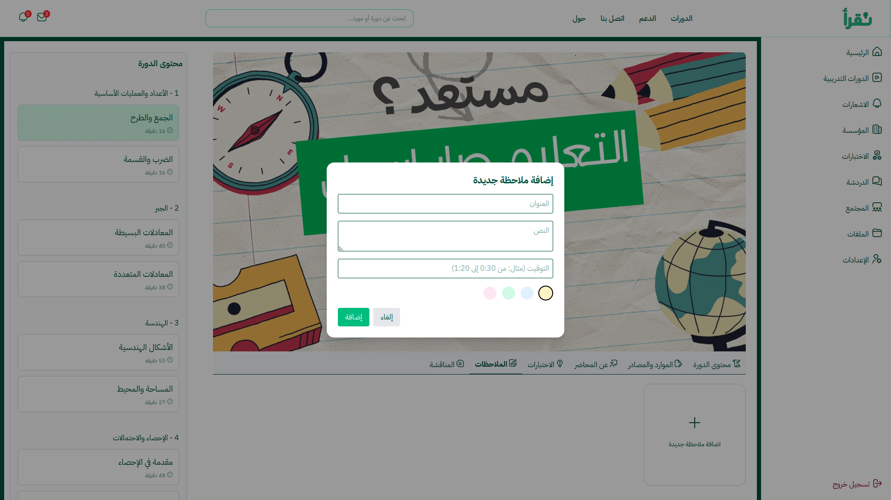
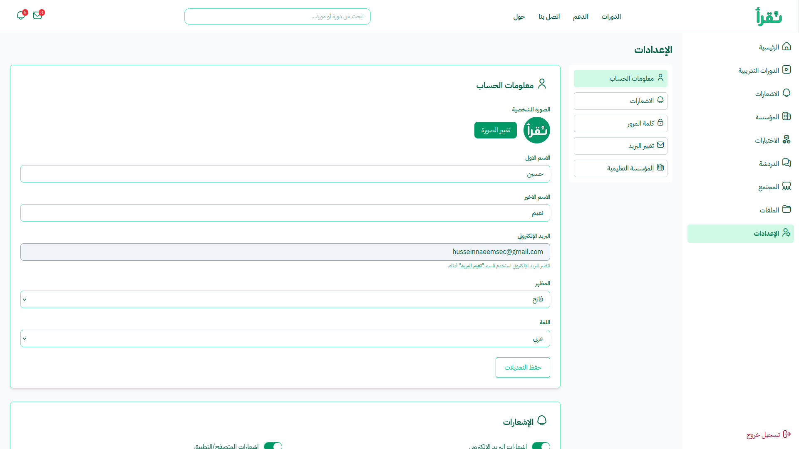
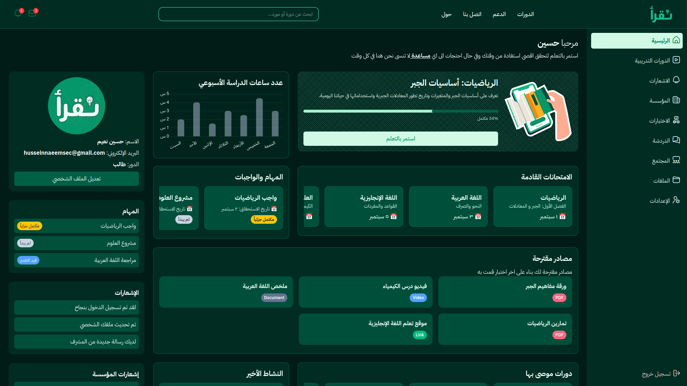
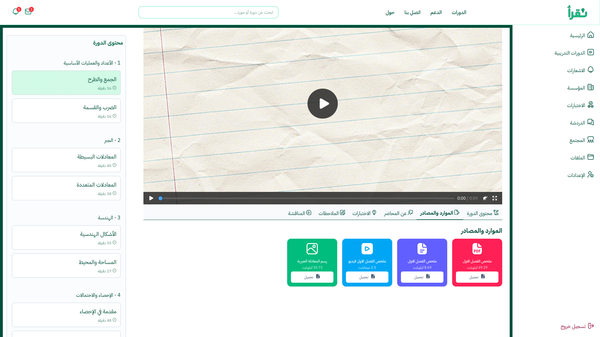

# Naqraa  

## Overview  
Naqraa is a community-driven learning platform for students in Iraq and the Arab world. It provides free courses, resources, and collaborative communities to help students grow academically and personally.  

## Features  
- Free Courses – Access curated courses across various subjects.  
- Resources – Download and share study materials and references.  
- Community & Chat – Connect with other students, ask questions, and share knowledge.  
- Research & Boards – Create research papers, boards, and collaborative projects.  
- Organization Management – Schools, universities, and institutes can manage their students and communities within Naqraa.  

## Getting Started  
1. Clone the repository:  
```bash
  git clone https://github.com/husseinnaeemsec/naqraa.git
```

2. Navigate to the project folder:

```bash
cd naqraa
```

3. Install dependencies:

```bash
npm install
```
4. Run the development server:

```bash 
npm run dev
```

## Screenshots









## Contact

For questions, suggestions, or collaborations:

[Email](mailto:husseinnaeemsec@gmail.com)

Check out [Naqraa](https://www.reddit.com/r/naqraa) on Reddit!